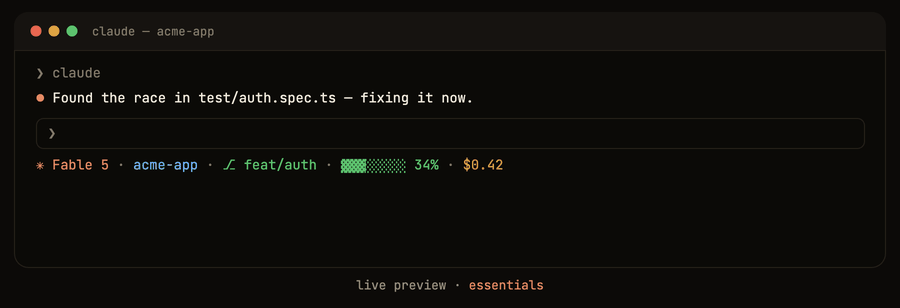
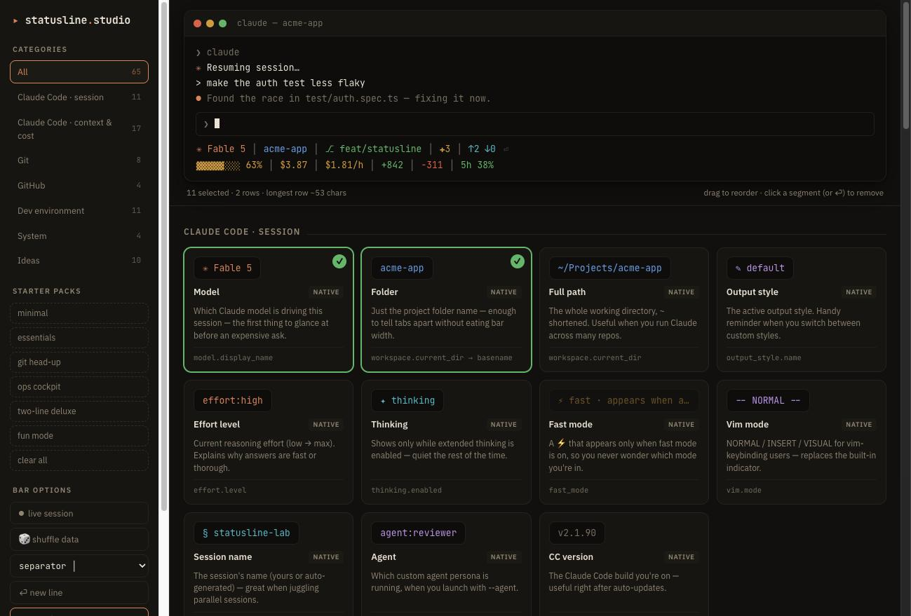

# ▸ Statusline Studio

Design your [Claude Code](https://code.claude.com) status line by clicking, not by guessing.

Statusline Studio is a zero-dependency, single-page webapp that lets you **compose a status
line visually** from 65 live-simulated data points — context window, session cost, git state,
CI checks, dev environment, even the song you're playing — and then hand Claude Code an exact
build spec plus a screenshot so it can build and *verify* the real thing.



## How it works

1. **Compose** — open `studio.html`, click cards to add segments, drag to reorder, hit
   `⏎ new line` for multi-row bars. A live ticker fakes a running session so you can watch
   threshold colors flip green → yellow → red before committing to a design.
2. **Copy for Claude** — one click puts a precise spec on your clipboard (every row, every
   segment's data source — stdin JSON path, shell command, or `gh` call — example rendering,
   exact 24-bit truecolor hex, conditional-visibility rules, caching guidance) and saves the
   target rendering to your Downloads as `statusline-target.png`.
3. **Paste & verify** — paste into Claude Code. Claude writes `~/.claude/statusline.sh`,
   wires up `settings.json`, runs the script against sample JSON, then reads the saved
   screenshot and compares its output against it until they match.

## Running it

No build step, no dependencies. Either:

- open `index.html` (landing) or `studio.html` (the app) directly in a browser, or
- serve the folder: `python3 -m http.server 8080`, or
- enable **GitHub Pages** on this repo (deploy from branch, root) — the landing page becomes
  your public URL.



> Tip: clipboard APIs (copy text / copy PNG) work best over `https://` or `http://localhost`.
> When the clipboard is blocked, the app falls back to a select-and-⌘C panel and a PNG
> download.

## What's simulated

| Category | Examples |
|---|---|
| Claude Code · session | model, folder, output style, effort, thinking, vim mode, agent |
| Claude Code · context & cost | context meter, tokens, cache reads, cost, burn rate, budget meter, compact ETA, rate limits |
| Git | branch, dirty count, ahead/behind, commit hash & age, stash, worktree |
| GitHub | PR + review state, CI checks, assigned issues, notifications |
| Dev environment | test status, type errors, TODO count, dev-server port, docker, VPN, node/venv/k8s/aws |
| System | clock, date, battery, hostname |
| Ideas | next meeting, pomodoro, deadline, day progress, weather, moon, now playing, ticker, streak, coffee |

Badges on each card tell you what powers it: `native` (piped stdin JSON), `shell`,
`gh cli`, `derived` (computed), or `idea` (needs a little extra tooling).

## Project layout

```
index.html    landing page
studio.html   the app (self-contained: no frameworks, no network calls)
LICENSE       Apache-2.0
```

## Contributing

Issues and PRs welcome — new segment ideas especially. Each segment is one small object in
the `SEGS` array in `studio.html` (name, category, source hint, description, color, render
function), so adding one is a ~10-line change.

## License

[Apache-2.0](LICENSE). Not affiliated with Anthropic; Claude Code is a trademark of
Anthropic, PBC.
